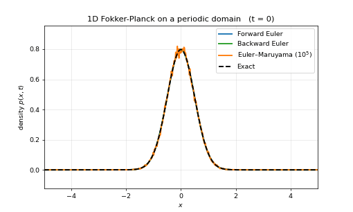

# 1D Fokker-Planck Solver

[](https://github.com/tommasocortopassi/fokker_planck_1d_solver/actions/workflows/tests.yml)

 *Three independent solvers against the exact solution:*

 

A Python implementation of a finite-volume solver for a 1-dimensional Fokker-Planck equation used in statistical physics, quantitative finance and diffusion models. This project implements solvers for :
- a **finite-volume PDE solver** (forward and backward Euler)
- an **Euler-Maruyama particle solver** for the equivalent stochastic
  differential equation (SDE)

driven by two front ends that share the same pipeline: a Tkinter GUI and a
one-call Python API. Both take the same initial condition, domain, and
boundary condition, and hand them to the same solvers. This README is a
practical overview and usage guide. For the full derivations (the origin
of artificial (numerical) diffusion, the von Neumann stability analysis
behind the CFL and Peclet numbers, and the Ito-calculus derivation that
connects the SDE to the PDE) see `docs/numerical_methods_notes.md`.

## Quickstart

```bash
git clone https://github.com/tommasocortopassi/fokker_planck_1d_solver.git
cd fokker_planck_1d_solver
pip install -e .
```

Three ways to use, same logic underneath: same solvers, same parameters,
same results.

**Notebook.** `fokker_planck_experiments.ipynb` runs all three solvers
against exact solutions on four problems, and ends with a playground cell
that mirrors the GUI field for field. It ships with its outputs, so it
reads without running; open it in
[Colab](https://colab.research.google.com/github/tommasocortopassi/fokker_planck_1d_solver/blob/master/fokker_planck_experiments.ipynb)
to change something.

**API.** For scripts and parameter sweeps:

```python
from fp1d import solve

run = solve(method='backward euler',
            drift='-x', diffusion=0.5,      # expression, callable or number
            left='-inf', right='+inf',      # truncated adaptively
            dx=0.02, total_time=2.0, dt=0.001,
            bc='neumann', initial_condition='gaussian')

x, p = run.result.x, run.result.snapshots[-1]   # density at t = T
```

**GUI.** `python run_gui.py`, or `fp1d-gui` once installed. Every parameter
is a field; results go to a timestamped folder under `output/`.

Requires Python 3.10+, plus `tkinter` for the GUI (bundled with CPython on
Windows and macOS, `apt install python3-tk` or equivalent on Linux).
Run the tests with `pytest`

## The equation

The Fokker-Planck equation describes how a probability density $p(x, t)$
evolves under a deterministic drift $b(x, t)$ and a diffusion coefficient
$D(x, t) \geq 0$:

$$
\partial_t p = -\partial_x( b(x,t) p ) + \partial_{xx}^2( D(x,t) p ) = -\partial_x J(x,t) \qquad (1)
$$

where the flux is $J(x,t) = b(x,t) p - \partial_x[D(x,t) p]$. Writing the
right-hand side as $-\partial_x J$ is what makes the finite-volume
discretization exactly conservative (see below). Physically, (1) is also an
`advection-diffusion equation`: it describes a quantity $p(x,t)$
transported by the velocity field $b(x,t)$ and diffused with coefficient
$D(x,t)$.

Equation (1) is also the density evolution equation for the Ito process

$$
dX_t = b(X_t, t) dt + \sqrt{2 D(X_t, t)} dW_t .\qquad (2)
$$

Both solvers in this repository target the same $p(x, t)$: one by
discretizing the PDE directly, the other by simulating an ensemble of paths
of (2) and estimating $p(x,t)$ empirically as a histogram.
`docs/numerical_methods_notes.md` derives (2) $\to$ (1) from scratch (the
Lagrangian-to-Eulerian route) and proves why the two really do describe the
same physics.

#### Remark on nomenclature
We always use the terms cells and faces as usual in finite-volume schemes,
but since we are in 1D we could replace such terms with intervals and
points.


## Running the GUI

```
pip install -r requirements.txt
python run_gui.py
```

### Fields

Listed in the order they appear in the window.

- **Method**: Forward Euler, Backward Euler, or Euler-Maruyama.
- **Left/right domain bound**: type a number, or `-inf`/`+inf` for an
  unbounded domain. An infinite bound is automatically truncated to a large
  finite interval for computation, and the log states clearly that this
  happened. The truncation is then *verified*: if the density turns out not
  to be negligible at the artificial boundary, the open side is enlarged and
  the problem re-solved (see `fp1d/domain_truncation.py`).
- **Spatial step dx**: cell width. The number of cells follows from it and
  the domain length; if `dx` doesn't divide the length exactly, the next
  smaller `dx` that does is used and the log says so.
- **Total time T** / **Time step dt**: simulation length and step size. If
  `dt` doesn't divide `T` exactly it is likewise shrunk to the nearest value
  that does, so a run always ends exactly at `T`.
- **Coefficient source**: `expression` to type $b$ and $D$ by hand, or
  `file` to load them from a `.npz`. Whichever you pick, the other input is
  greyed out, so it is never ambiguous which one is in effect.
- **Drift** / **Diffusivity**: Python expressions in `x` (an array of cell
  centers) and `t`, with `numpy` available as `np` (e.g. `-x*np.ones(len(x))`
  or `0.2 + 0.1*np.sin(t)`). A scalar result is broadcast over the grid.
  Only `np` and a small set of builtins are exposed; the expression cannot
  import modules or touch the filesystem. $D$ must be non-negative.
- **Coefficient file (.npz)**: an alternative to typing the above (tabulated $b$ and $D$ sampled on their own $x$ (and optionally $t$) grid,
  interpolated onto whatever the solver asks for). See
  `coefficients/README.md` for the file format. **Refresh list** re-scans
  the folder if you drop a new file in while the window is open.
- **Trials**: number of particle trajectories (Euler-Maruyama only).
- **Boundary condition**: `periodic`, `dirichlet`, or `neumann`, all in
  their homogeneous form. `periodic` additionally requires $b$ and $D$ to
  agree at the two domain edges, otherwise the flux at the seam would be
  ambiguous, and the run stops with an error saying so.
- **Initial condition**: `gaussian`, `uniform`, `bimodal`, `left-block`, or
  `custom`, always renormalized to unit mass.
- **Custom expression**: used only when the initial condition above is
  `custom`. A Python expression in `x` under the same restrictions as the
  drift field, e.g. `np.exp(-0.5*(x/0.6)**2)`, and it must be non-negative.
- **Random seed**: reproducibility for the Euler-Maruyama scheme.
- **Saved output times**: comma-separated times at which the density is
  recorded, used for the snapshot plot, the mass history, and the saved
  `.npz`. `0` and `T` are always included. This field always follows `T`:
  editing `T` resets it to the default spacing `0, T/5, ..., T` and discards
  anything you had typed, so set `T` first and customise the output times
  after.

Two read-only displays sit below the fields: a **truncation preview**, which
updates as you type and shows the domain and `dx` the run would actually use,
and an **active coefficients** box confirming which $b$ and $D$ are currently
in effect.

### Buttons

**Show diagnostics**: reports the advective CFL number $\lambda$, the
diffusion number $\mu$, the combined stability number $\lambda + 2\mu$, the
Peclet number, and the suggested Forward-Euler $dt$ - all without running
anything. A large Peclet number is the signal that the numerical diffusion
introduced by upwinding is significant relative to the true $D$ on this
grid; `docs/numerical_methods_notes.md` §1.4 quantifies it.

**Run solver**: starts the computation in a background thread (the window
stays responsive). Before starting, it runs the same pre-flight checks
`fp1d.solve` runs, and asks for confirmation if any of them fires: Forward
Euler with $\lambda + 2\mu > 1$, or a cell Peclet number above 2. A periodic
run whose $b$ or $D$ disagree at the two edges is reported as an input
error instead.

**Stop**: requests early termination. The run still saves whatever it
computed up to that point - but what "up to that point" means depends on the
method, because the two families traverse the problem in different orders.

- *Forward/Backward Euler* march one density forward in time, so progress is
  reported as completed steps and the simulated time reached, and stopping
  truncates the **time axis**: you get $p(x,t)$ up to the moment you stopped,
  at full accuracy.
- *Euler-Maruyama* simulates trajectories in batches, each carried from $0$
  all the way to $T$ before the next batch starts. There is therefore no
  single "current time" to report, and progress is shown as **completed
  trials**. Stopping costs **samples, not time**: every trajectory that
  finished ran the whole interval, so the saved density still covers all of
  $[0, T]$ - it is simply rougher, with visibly larger fluctuations, because
  Monte Carlo error shrinks only as $1/\sqrt{N}$ in the number of
  trajectories. `simulation_parameters.json` records `trials_completed`
  alongside the requested `trials_maruyama`, so the sample count behind any
  saved estimate is always recoverable.

Each run creates a timestamped folder under `output/` containing a snapshot
plot, a mass-history plot, the raw solution (`.npz`), the run parameters
(`.json`), and an animation (`.mp4`, or `.gif` if `ffmpeg` isn't available).
The animation plays back the frames the solver actually recorded during
integration, not an artificially interpolated smoothing of a few snapshots.

## Using it from Python

The GUI is one front end; `fp1d.solve` is the other. They take the same
inputs and run the same code: `gui.py` reads its arguments off the widgets
and then calls `solve` like any other caller would, so the two can never
drift apart. Use the API for parameter sweeps, for notebooks etc.


`run.result` is the same `SolverResult` the integrators return directly,
`run.grid` is the grid actually used - wider than requested if a bound was
infinite - and `run.messages` collects the notes the GUI would have shown in
its log. `run.save` returns the path of every file it wrote.

Drift and diffusivity accept three forms: a callable `f(x, t)`, a number, or
a string evaluated in a restricted namespace containing `x`, `t`, and numpy
as `np` - so mathematical functions are written `np.cos(t)`, `np.exp(-x**2)`,
and so on. Only a small whitelist of builtins is exposed alongside them; no
imports and no filesystem access.

`solve` performs stability checks and also checks whether $b$ and $D$  satisfy the
necessary conditions (such as $D \geq 0$, or the periodicity condition in 
the case of periodic BC), giving errors or warnings as the GUI does.

### Pre-flight checks

Before integrating, `solve` runs the same checks the GUI does, and
`on_warning` decides what happens when one fires:

```python
from fp1d import solve

run = solve(method='backward euler',
            drift='-x', diffusion=0.5,      # expression, callable or number
            left='-inf', right='+inf',      # truncated adaptively
            dx=0.02, total_time=2.0, dt=0.001,
            bc='neumann', initial_condition='gaussian')

x, p = run.result.x, run.result.snapshots[-1]   # density at t = T
run.save('output')                              # same files the GUI writes
```


```
WARNING: Forward Euler is unstable for these settings: lambda + 2*mu = 4.995
exceeds the stability limit of 1 (dt = 0.01; suggested dt <= 0.002002). The
solution will grow without bound rather than converge.
Continue anyway? [y/n]
```

- `'warn'` emits a `UserWarning` and continues. The default, because it is
  the only mode that behaves sensibly everywhere this package runs.
- `'ask'` prints the warnings and waits for a `y`/`n` on the terminal,
  raising `RunAborted` on a refusal. It falls back to `'warn'` when stdin
  is not a terminal: a prompt nobody can answer would hang a test suite, a
  notebook cell, or the GUI's worker thread.
- `'raise'` turns the first warning into a `RunAborted` - useful in a
  parameter sweep, where an unstable point should be recorded rather than
  silently produce garbage.
- `'ignore'` proceeds silently. What the GUI passes, having already asked.

## Project layout

```
Fokker-Planck Solver/
  run_gui.py                       entry point: launches the GUI
  requirements.txt                 runtime dependencies
  requirements-dev.txt             test dependencies
  fokker_planck_experiments.ipynb  the three solvers vs. exact solutions
  docs/
    numerical_methods_notes.md     full derivations behind this README
  coefficients/
    README.md                      the .npz coefficient file format
    make_examples.py               regenerates the example files below
    ou_static.npz                  b(x) = -x, D(x) = 1
    ou_breathing.npz               time-dependent b, static D
    varying_diffusion.npz          b = 0, D peaked at the center
  fp1d/                            the package
  tests/                           pytest suite
  output/                          created at runtime, one folder per run
```

### The `fp1d` package

Grouped by role rather than alphabetically, since that is roughly the order
in which a run passes through them.

**Defining the problem**

| File | What it holds                                                                                                                                                                                               |
|---|-------------------------------------------------------------------------------------------------------------------------------------------------------------------------------------------------------------|
| `grid.py` | `Grid1D`, the uniform cell-centered grid (cell centers, faces, `dx`); `make_grid`, which builds one from a requested `dx`; and `finite_domain`, which substitutes finite numbers for `+/-inf` bounds        |
| `boundary_conditions.py` | `BoundaryCondition`, a one-field record naming the condition. Only the homogeneous form of each is supported                                                                                                |
| `initial_conditions.py` | The four presets and the sandboxed custom-expression evaluator, all normalized to unit mass, plus `sample_particles_from_density` so the SDE solver starts from the *same* state as the PDE solver          |
| `coefficients_io.py` | Loads $b$ and $D$ from a `.npz` file and wraps them as `(x, t)` callables, interpolating and clamping rather than extrapolating outside the saved range  |

**Solving**

| File | What it holds                                                                                                                                                                                                                                                                                                                               |
|---|---------------------------------------------------------------------------------------------------------------------------------------------------------------------------------------------------------------------------------------------------------------------------------------------------------------------------------------------|
| `finite_volume.py` | The Eulerian solver. `assemble_operator` builds the sparse $A$ in $\dot p = Ap$ face by face (vectorized, then summed into a `coo_matrix`); `forward_euler` and `backward_euler` share one time-stepping loop. When $b$ and $D$ don't depend on $t$, the operator (and, for the implicit scheme, its factorization) is built once and reused |
| `stochastic_solver.py` | The Lagrangian solver: Euler-Maruyama on the equivalent SDE, with the density recovered as a normalized histogram. Boundaries become particle rules (wrap, reflect, absorb). Trajectories run in batches, each taken from $0$ to $T$, which is what lets an interrupted run still describe the whole interval - from fewer samples                                                         |
| `domain_truncation.py` | Wraps either solver when a bound was `+/-inf`: solve, check whether the density at the artificial boundary is negligible, enlarge the open side(s) and re-solve if not                                                                                                                    |

**Shared machinery**

| File | What it holds |
|-|--|
| `results.py` | `SolverResult`, the single return type all three integrators produce, plus `discrete_mass` and two recorders: `SolutionRecorder` for solvers that advance in time, and `EnsembleRecorder`, which sums histogram counts over batches of trajectories so a Monte Carlo estimate is available at any point|
| `diagnostics.py` | The CFL, diffusion, combined-stability and Peclet numbers, computed pointwise over the run rather than from separately-maximized coefficients. `preflight_warnings` turns those numbers into the messages both front ends report before a run. Also the periodic-consistency check and the time-dependence probe the solvers use to decide what can be cached |

**Front ends**

Two ways in, one pipeline. Neither contains any numerics of its own.

| File | What it holds |
|---|---|
| `api.py` | `solve`, the programmatic entry point: normalizes the arguments (method aliases, coefficients given as expressions or callables or numbers, `+/-inf` bounds), runs the pre-flight checks under the `on_warning` policy, drives the pipeline, and returns a `Run` bundling the `SolverResult`, the grid actually used, the log messages, and the run parameters. `Run.save` writes the five output files |
| `gui.py` | The Tkinter application. Reads the widgets on the main thread into a `RunConfig`, runs the pre-flight checks there (where a dialog is legal), then hands the config to `solve` on a worker thread with `on_warning='ignore'` - so everything here is presentation: layout, live diagnostics, the truncation preview, progress reporting, and the summary |
**Output**

| File | What it holds |
|---|---|
| `visualization.py` | Snapshot overlay, mass-history plot, animation (mp4 with a gif fallback), and the raw `.npz` dump. Forces matplotlib's `Agg` backend, since plotting happens on a worker thread |
| `io_utils.py` | Timestamped run directories and JSON writing |

A run therefore flows: `gui` builds a `RunConfig`, or a script calls `solve`
directly → `api` resolves the coefficients and bounds → `domain_truncation`
drives one or more attempts → each attempt builds a grid and initial
condition and calls `finite_volume` or `stochastic_solver` → the result comes
back as a `SolverResult` → `visualization` and `io_utils` write it to disk.

## Tests

```
pip install -r requirements-dev.txt
pytest tests/ -v
```

Various tests, each file covering one property:

| File | What it pins down |
|---|---|
| `test_conservation.py` | Mass is conserved *exactly* under periodic and reflecting boundaries and decays under an absorbing one |
| `test_time_stepping.py` | A run ends at `T` for any `dt`, including one that doesn't divide it. |
| `test_dirichlet_regression.py` | Forward and backward Euler agree where the boundary is doing real work, and the boundary flux converges under grid refinement with $D$ varying at the wall |
| `test_domain_truncation.py` | The adaptive-domain verdict doesn't depend on which output times were requested, and enlargement works for an initial condition far from the origin |
| `test_pde_sde_consistency.py` | The two solvers agree on absorbed mass, and on the spread produced by a spatially varying $D$ |
| `test_stationary_distribution.py` | An Ornstein-Uhlenbeck process relaxes to the right mean, and the error in the recovered stationary variance shrinks under grid refinement |
| `test_initial_conditions.py` | Presets and custom expressions normalize to unit mass, sampled particles reproduce the density, and infinite bounds are substituted correctly |
| `test_stop_event.py` | All three solvers honor an early-stop request and report it, including that an interrupted Euler-Maruyama run still spans $[0, T]$ and equals a full run with that many trials |
| `test_api.py` | `solve` reproduces a hand-assembled solver call exactly, treats the three coefficient forms as equivalent, grows an unbounded domain, and rejects bad inputs |
| `test_edge_cases.py` | Non-positive `T` or `dt` are rejected, a constant custom initial condition is broadcast, a diffusivity negative only at a Dirichlet wall is caught, save times outside the run are dropped, `parse_bound` accepts a typeset minus, and an unused `t` axis is not reported as a time range |
| `test_warnings.py` | Each `on_warning` mode behaves as documented, `'ask'` degrades instead of blocking without a terminal, only Forward Euler gets the stability warning |

## Reading order

The package is a directed acyclic graph three levels deep: eight modules
import nothing else from `fp1d`, and no module ever imports something that
transitively imports it back. The code can be read strictly bottom-up, where
every file below relies only on the files above it, so nothing is ever a
forward reference.

The order below builds the problem before it solves it: first the objects a
run is described *with*, then the machinery that carries a run's output,
then the two solvers, and finally the two front ends that assemble
everything into one call.

**1. `boundary_conditions.py`** (32 lines) — start here: the smallest
complete module in the package. A module-level constant, one frozen
dataclass with a single field and one validating method. It names the
boundary conditions the rest of the package works with.

**2. `grid.py`** (131 lines) — `Grid1D` is a frozen dataclass whose derived
quantities (`dx`, `faces`, `centers`) are computed on demand rather than
stored, and whose invariants are checked in `__post_init__`. `parse_bound`
and `finite_domain` handle `inf` and the various ways a user can type a
bound.

**3. `results.py`** (244 lines) — `SolverResult` is a plain record;
`discrete_mass` is the one-line quadrature used everywhere;
`SolutionRecorder` and `EnsembleRecorder` are the first classes with
genuinely mutable state, accumulating frames as a run proceeds. Reading
these before the solvers is what makes the solver loops look as short as
they do: all of their bookkeeping lives here.

**4. `initial_conditions.py`** (153 lines) — the presets, and `safe_eval`:
`eval` with its globals replaced by a nine-name whitelist. The
error-handling block: three different Python exceptions are flattened into
one `ValueError` whose message is written for the person typing into the
GUI. `sample_particles_from_density` is what lets the SDE solver start from
exactly the same state as the PDE solver.

**5. `coefficients_io.py`** (170 lines) — loading `b` and `D` from an
`.npz` file. The important construct is `_build_interpolator`, a function
that *returns a function*: the returned closure carries the saved samples
with it and is called later as `coefficient(x, t)`, indistinguishable from
a typed expression. Array shapes carry meaning here — `(nx,)` means static,
`(nt, nx)` means time-dependent.

**6. `diagnostics.py`** (192 lines) — pure functions, no state: the CFL,
diffusion, combined-stability and Peclet numbers, sampled pointwise over
the run. `preflight_warnings` turns those numbers into the sentences both
front ends show. Short and worth reading in full, because both solvers and
both front ends call into it.

**7. `finite_volume.py`** (308 lines) — the numerical core, and the densest
file in the package. `assemble_operator` builds the sparse matrix $A$ in
$\dot p = Ap$ face by face; the flux discretizes
$\partial^2(Dp)/\partial x^2$. `forward_euler` and `backward_euler` each
define a local `step` function and hand it to the shared `_run` loop.

**8. `stochastic_solver.py`** (217 lines) — the same equation from the
Lagrangian side: Euler-Maruyama on particle paths, with the density
recovered as a normalized histogram. Boundary conditions become particle
rules (wrap, reflect, absorb). Read it directly after `finite_volume.py`,
while that one is still fresh: the pairing of the two descriptions is the
point of the project.

**9. `domain_truncation.py`** (186 lines) — needed when the domain is
unbounded. It calls the function it was given on progressively wider grids
until the density reaching the artificial boundary is negligible, without
knowing anything about which solver it is holding.

**10. `api.py`** (464 lines) — everything above, assembled. `solve` itself
computes nothing: it normalizes heterogeneous inputs into canonical forms
(method aliases through a dict, coefficients into `(x, t)` callables via
`_as_coefficient`, bounds into floats), validates in order of increasing
cost, delegates to `domain_truncation`, and packages the result in a `Run`.
The body is a linear sequence of stages with no deep branching, so it reads
top to bottom.

**11. `gui.py`** (711 lines) — the same pipeline driven by widgets, and the
largest file. Nothing numerical happens here.

Two things to read alongside rather than in sequence: `tests/`, where each
file pins down one property and the shortest of them double as usage
examples, and `fokker_planck_experiments.ipynb`, which checks all three
solvers against exact solutions. `visualization.py` (119 lines) and
`io_utils.py` (24 lines) can be read last or skipped; they are plotting and
file-writing helpers and depend on nothing else.

